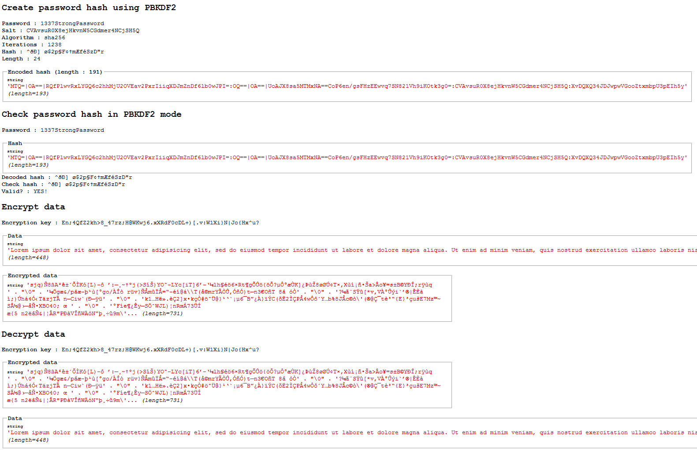

[](https://packagist.org/packages/crazy-max/cws-crypto)
[](https://php.net/)
[](https://travis-ci.com/crazy-max/CwsCrypto)
[](https://www.codacy.com/app/crazy-max/CwsCrypto)
[](https://github.com/sponsors/crazy-max)
[](https://www.paypal.me/crazyws)

## :warning: Abandoned project

This project is not maintained anymore and is abandoned. Feel free to fork and make your own changes if needed.

Thanks to everyone for their valuable feedback and contributions.

## About

PHP class for password hashing with multi encryption methods.

## Overview

### The PBKDF2 key derivation function

Defined by RSA's PKCS #5: https://www.ietf.org/rfc/rfc2898.txt<br />
This implementation of PBKDF2 was originally created by https://defuse.ca/php-pbkdf2.htm<br />
With improvements by http://www.variations-of-shadow.com

### The OpenBSD-style Blowfish-based bcrypt

This hashing method is known in PHP as CRYPT_BLOWFISH.<br />
More infos : http://www.php.net/security/crypt_blowfish.php<br />
This implementation of BCRYPT was originally created by http://www.openwall.com/phpass/

### Generate random bytes
 
 A random() function is available to generate secure random bytes with 5 methods :
* [mcrypt_create_iv](http://php.net/manual/en/function.mcrypt-create-iv.php)
* [openssl_random_pseudo_bytes](http://php.net/manual/en/function.openssl-random-pseudo-bytes.php)
* [GetRandom](http://msdn.microsoft.com/en-us/library/aa388176%28VS.85%29.aspx) function from CAPICOM Microsoft class
* [/dev/urandom](http://en.wikipedia.org/wiki//dev/random) on Unix systems
* Mix of [microtime](http://php.net/manual/en/function.microtime.php) and [getmypid](http://php.net/manual/en/function.getmypid.php) functions

### Encrypt/Decrypt datas

There is also a method to encrypt/decrypt data using a symectric encryption string with the blowfish algorithm and an encryption key in CFB mode but please be advised that you should not use this method for truly sensitive data. 

## Installation

```bash
composer require crazy-max/cws-crypto
```

And download the code:

```bash
composer install # or update
```

## Getting started

See `tests/test.php` file sample to help you.

## Example



## Methods

**hashPassword** - Create a password hash.<br />
**checkPassword** - Check a hash with the password given.<br />
**encrypt** - Generate a symectric encryption string with the blowfish algorithm and an encryption key in CFB mode.<br />
**decrypt** - Return the decrypted string generated from the encrypt method.<br />
**random** - Generate secure random bytes with 5 methods : mcrypt_create_iv, openssl_random_pseudo_bytes, GetRandom() from CAPICOM Microsoft class, /dev/urandom on Unix systems or mt_rand() and getmypid() functions.<br />

**setPbkdf2Mode** - Set the pbkdf2 mode for hashing/check password.<br />
**setBcryptMode** - Set the bcrypt mode for hashing/check password. (default)<br />
**setEncryptionKey** - Set the encryption key for encrypt/decrypt method (max length 56).<br />
**getError** - Get the last error.<br />

## How can I help ?

All kinds of contributions are welcome :raised_hands:! The most basic way to show your support is to star :star2: the project, or to raise issues :speech_balloon: You can also support this project by [**becoming a sponsor on GitHub**](https://github.com/sponsors/crazy-max) :clap: or by making a [Paypal donation](https://www.paypal.me/crazyws) to ensure this journey continues indefinitely! :rocket:

Thanks again for your support, it is much appreciated! :pray:

## License

MIT. See `LICENSE` for more details.
